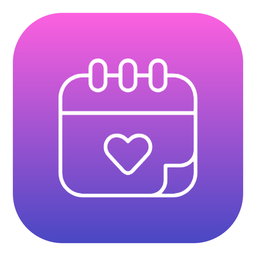

<p align="center">
  
</p>

# Smart Calendar Manager

[English](README.md) | [Español](README.es.md)

[](https://dotnet.microsoft.com/)
[](https://learn.microsoft.com/windows/apps/winui/winui3/)
[](https://github.com/microsoft/WindowsAppSDK)
[-4EBA6F?style=flat&logo=xunit&logoColor=white)](https://xunit.net/)
[](LICENSE)

---


### 1. Descripción del Proyecto
**Smart Calendar Manager** es una aplicación de escritorio nativa para Windows 11 diseñada para conectar tus agendas personal y laboral, automatizar la preparación para videoconferencias y lanzar herramientas programadas mediante una interfaz visual intuitiva. Lee **Google Calendar** (o cualquier calendario) mediante feeds iCal RFC 5545 secretos — un feed laboral y los personales que quieras, sin OAuth —, genera un Apps Script que bloquea tus eventos personales en el calendario laboral manteniendo total privacidad ("🔒 Ocupada"), notifica y abre herramientas de notas unos minutos antes (configurable) de reuniones con enlace de videollamada y dispara lanzamientos programados sin necesidad de escribir sintaxis cron.

### 2. Funcionalidades Principales
- 📅 **Agenda Diaria y Detección de Videollamadas:** Vista en tiempo real de las reuniones del día con botón directo para unirse (Google Meet, Zoom, Microsoft Teams, Webex). Auto-refresco cada 15 minutos en segundo plano.
- 🗂️ **Varios Feeds iCal, Sin OAuth:** Agrega URLs iCal secretas laborales y personales; la agenda las combina con una etiqueta Laboral/Personal, y si un feed falla los demás se siguen mostrando.
- 🔒 **Bloqueo de Disponibilidad Personal ➔ Laboral (Apps Script):** Un asistente genera un Google Apps Script con tus feeds personales incluidos. Corre en la cuenta laboral y crea bloqueos privados, así que funciona aunque el Workspace bloquee apps OAuth de terceros. Ver `docs/work-calendar-apps-script.md` (los eventos recurrentes no se expanden).
- 🥑 **Automatización Pre-Reunión:** Alertas antes de reuniones elegibles (5 minutos por defecto, configurable) con auto-apertura de Granola solo en reuniones con enlace de videollamada (solo feeds laborales o todos), botón "Abrir Granola" en la agenda que además abre el enlace de la reunión, y banner descartable que recuerda eventos ignorados.
- ⏰ **Lanzador de Apps Programado (Cron Visual):**
  - Píldoras amigables de días (L M X J V S D), `TimePicker` y selección de app/URI destino (`slack://`, ejecutables o URLs web).
  - Motor de ejecución con `System.Threading.Timer` y evaluación de máscaras de bits con 0% de consumo de CPU en reposo.
- 💻 **Fluent Design y Bandeja del Sistema:** Fondo Mica nativo de Windows 11, tarjetas Fluent y minimización a la bandeja del sistema con `H.NotifyIcon.WinUI`.
- 🛡️ **Estabilidad Desktop y Diagnóstico:** Manejadores globales de excepciones con volcado a disco en `%LOCALAPPDATA%\SmartCalendarManager\Logs`.
- 🚀 **Actualizaciones e Instalador:** Verificador de versiones vía GitHub Releases API y script de instalador Inno Setup (`installer.iss`).

### 3. Tecnologías Utilizadas
- **Framework de UI:** WinUI 3 (Windows App SDK 2.4 / 2.5) con Fluent Design y fondo Mica
- **Entorno de ejecución:** .NET 9 (`net9.0-windows10.0.26100.0`, unpackaged)
- **Arquitectura:** Arquitectura Limpia + MVVM (`CommunityToolkit.Mvvm` 8.4)
- **Inyección de Dependencias:** `Microsoft.Extensions.Hosting`
- **Bandeja del Sistema:** `H.NotifyIcon.WinUI`
- **Motor de Calendario:** Parser RFC 5545 iCalendar (`.ics`) sin dependencias externas con soporte de RRULE, TZID y regex para links de videollamada
- **Instalador:** Script Inno Setup (`installer.iss`)
- **Pruebas Unitarias:** suite de pruebas con xUnit y Moq

### 4. Aprendizajes Clave
- Construcción de aplicaciones WinUI 3 unpackaged en .NET 9 con biblioteca de dominio desacoplada (`SmartCalendarManager.Core`) para 100% de testeabilidad.
- Sortear las restricciones OAuth de Workspace leyendo feeds iCal secretos y moviendo la escritura del calendario a un Apps Script de primera parte.
- Evaluación de recurrencias complejas RFC 5545 (RRULE) y conversión de zonas horarias IANA/Windows con zero dependencias externas.
- Manipulación de máscaras de bits (`DayOfWeekFlags`) para interfaces de usuario amigables tipo cron visual.

### 5. Instrucciones de Instalación Local

#### Requisitos Previos
- Windows 10 (versión 1809+) o Windows 11
- [.NET 9.0 SDK](https://dotnet.microsoft.com/download/dotnet/9.0)

#### Compilación y Ejecución
```powershell
# Clonar el repositorio
git clone https://github.com/AnaCataVC/smart-calendar-manager.git
cd smart-calendar-manager

# Compilar la app (también compila Core)
dotnet build src/SmartCalendarManager.App/SmartCalendarManager.App.csproj -c Release -p:Platform=x64

# Ejecutar pruebas unitarias
dotnet test tests/SmartCalendarManager.Tests/SmartCalendarManager.Tests.csproj

# Iniciar aplicación
dotnet run --project src/SmartCalendarManager.App/SmartCalendarManager.App.csproj -p:Platform=x64
```

> **Problema conocido:** `dotnet build SmartCalendarManager.sln` hoy falla con `NETSDK1032` (RuntimeIdentifier `win-x64` vs PlatformTarget `x86`) porque la solución asigna el proyecto App a x86. Compila el proyecto App con `-p:Platform=x64` como arriba mientras no se corrijan las plataformas de la solución.

#### Configuración
Ver [`docs/configuration.md`](docs/configuration.md) para los feeds de calendario, el alcance de Granola, el bloqueo del calendario laboral con Apps Script y la migración desde la versión con OAuth.

---

## Licencia

Este proyecto está bajo la Licencia MIT. Consulta el archivo [LICENSE](LICENSE) para más detalles.

